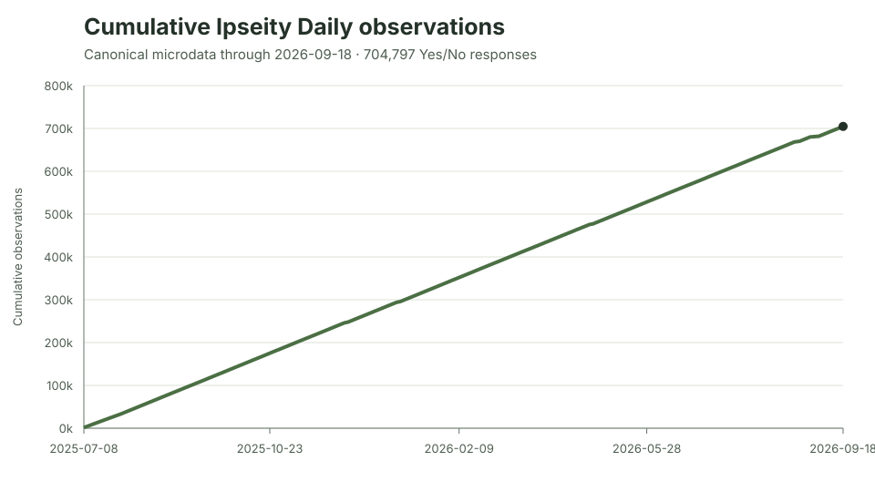
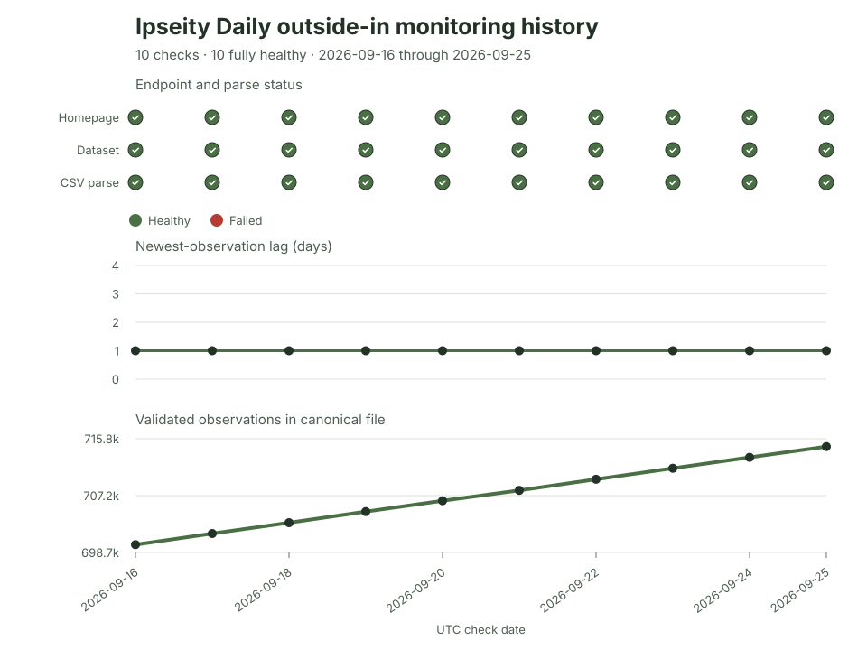
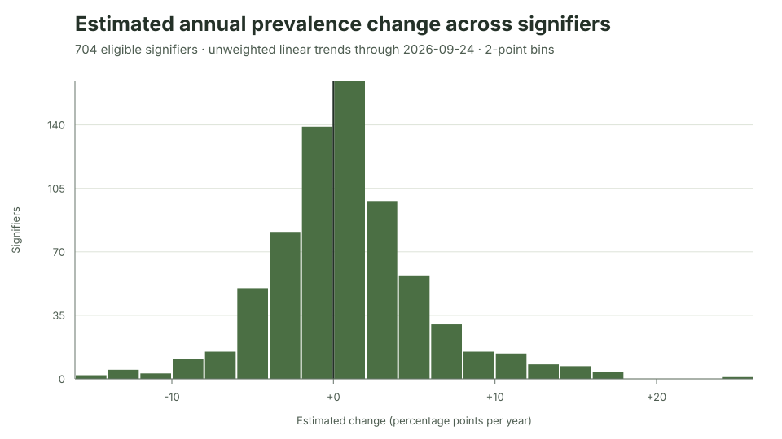
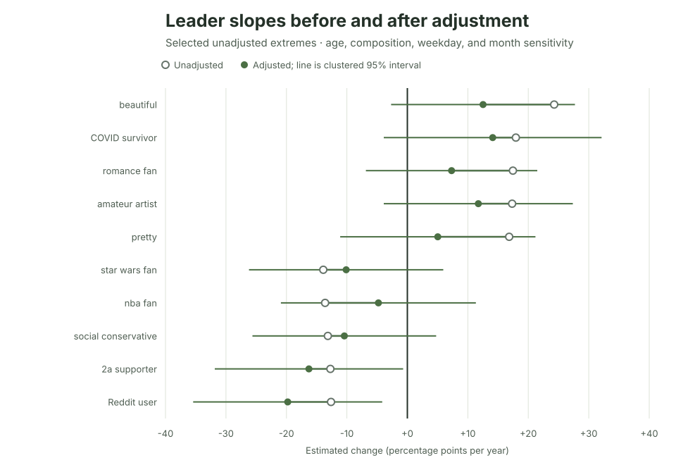
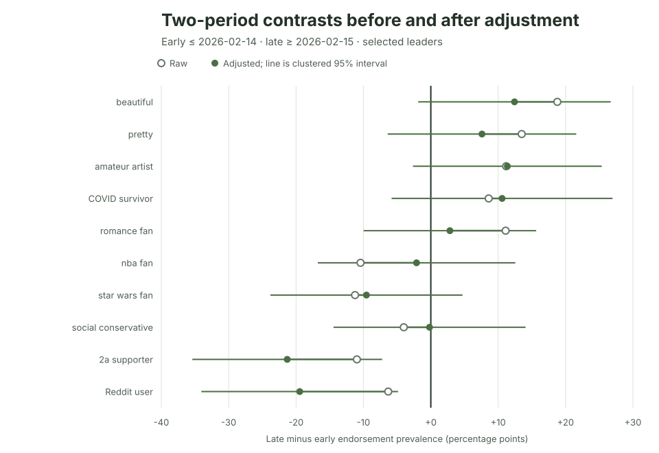
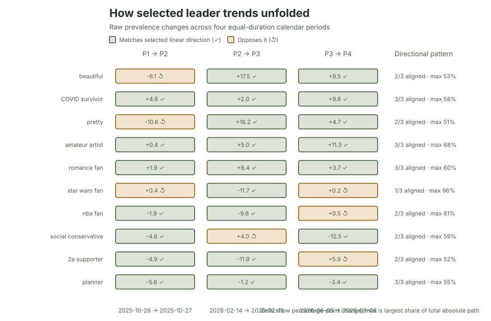
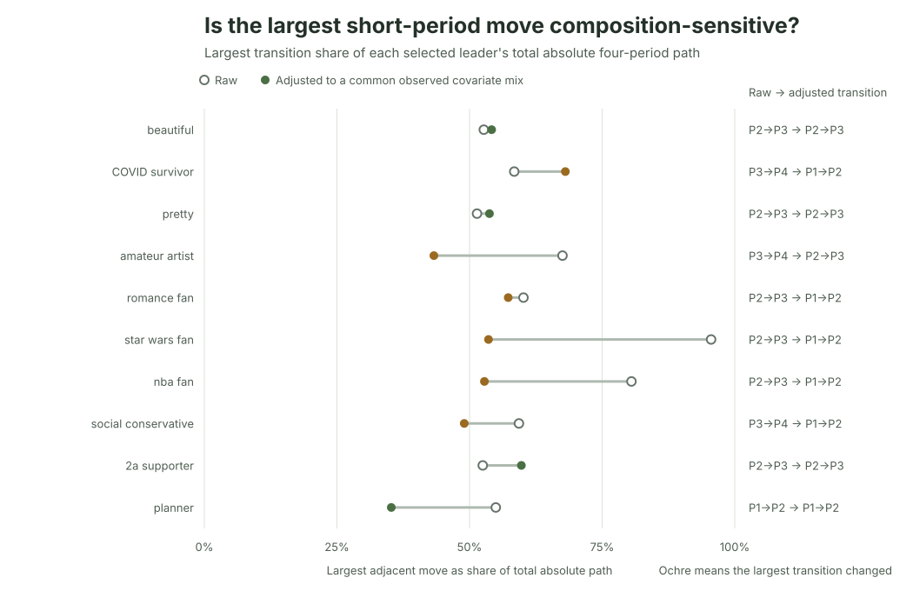
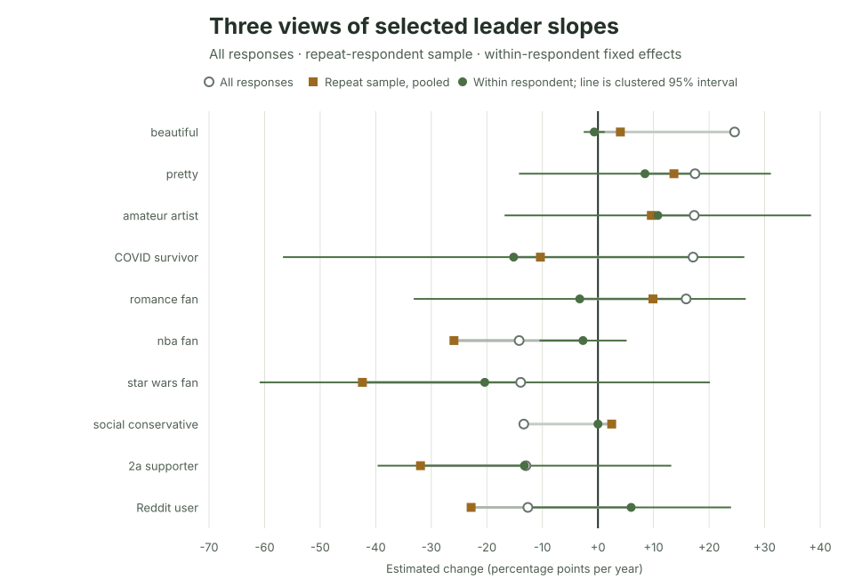

# Current monitoring and prevalence findings

Current through the monitoring check at **2026-09-26T10:02:00Z**. This file is
replaced when the analysis is refreshed; it is not an archive.

## Monitor

The Ipseity Daily homepage and canonical microdata both returned HTTP 200. The
gzip parsed as UTF-8 CSV with the documented schema and contained
**716,237 observations** from **2025-07-08** through
**2026-09-25**, spanning **5,059 hashed respondents**
and **707 signifiers**. No malformed rows or duplicate
respondent/date/signifier keys were detected. The newest observation was
1 day behind the check date, and this
check records no anomaly.

The cumulative series is derived from observation dates inside the current
microdata, while `data/monitoring-history.csv` preserves the separate sequence
of outside-in checks for longitudinal monitoring. Across
**11 checks**, **11**
had a reachable homepage, a retrieved and parseable canonical file, and no
anomaly. The file gained
**16,402 observations** from
the first recorded check to the latest. This short run is an operational view,
not an estimate of long-run service reliability.

## Estimated signifier prevalence change

For each signifier, an unweighted linear probability model regresses its binary
endorsement response on observation date. The slope is annualized to percentage
points per year. The histogram includes **704 of
707 signifiers** with at least 300 responses,
30 distinct observation dates, and a 180-day
span. These are descriptive sample trends, not population-weighted or causal
estimates. The median estimate is **+0.5
percentage points per year**; the middle half runs from -1.9 to
+3.0 points.

Uncertainty now uses a respondent-clustered sandwich estimator, so repeat
answers by the same hashed respondent are not treated as independent. The file
contains **538,206 respondent–signifier clusters**;
the largest has 50 responses. Across 704 eligible
trend tests, **0** have Benjamini–Hochberg q-values at or below
0.05, and **0** meet the more conservative Bonferroni
0.05 threshold.

### Fastest estimated growth

| Signifier | Annual change (pp) | Clustered 95% CI | BH q | Bonferroni p | Responses |
|---|---:|---:|---:|---:|---:|
| beautiful | +24.0 | [+10.8, +37.1] | 0.117 | 0.244 | 458 |
| pretty | +17.4 | [+3.4, +31.4] | 0.413 | 1.000 | 422 |
| amateur artist | +17.2 | [+5.0, +29.4] | 0.311 | 1.000 | 424 |
| romance fan | +17.0 | [+4.6, +29.4] | 0.348 | 1.000 | 468 |
| COVID survivor | +16.6 | [+2.1, +31.0] | 0.450 | 1.000 | 398 |

### Fastest estimated shrinkage

| Signifier | Annual change (pp) | Clustered 95% CI | BH q | Bonferroni p | Responses |
|---|---:|---:|---:|---:|---:|
| star wars fan | -14.2 | [-27.3, -1.2] | 0.483 | 1.000 | 427 |
| nba fan | -14.2 | [-27.4, -1.0] | 0.500 | 1.000 | 409 |
| social conservative | -13.8 | [-25.5, -2.0] | 0.423 | 1.000 | 432 |
| 2a supporter | -13.2 | [-26.2, -0.2] | 0.545 | 1.000 | 381 |
| planner | -13.0 | [-24.5, -1.5] | 0.450 | 1.000 | 419 |

The largest point estimate is **beautiful** at
24.0 percentage points
per year; the most negative is **star wars fan** at
-14.2 points per year.
The intervals account for dependence within hashed respondents but not changing
sample composition, calendar structure, or model misspecification. The
Benjamini–Hochberg screen follows the original independent-test procedure;
correlation among signifier tests makes the Bonferroni column an important
conservative sensitivity check. Point-estimate rankings selected from
704 tests remain monitoring leads, not evidence that the underlying
US adult population changed at those rates.

## Composition and calendar sensitivity

As a targeted robustness check, the ten most positive and ten most negative
unadjusted slopes were refit with respondent-clustered uncertainty after
adjusting for linear age, missing age, demographics availability, sex,
ethnicity, student status, employment, weekday, and month of year. **20
of 20** leaders retained their original direction. The median
absolute slope shift was **5.3 percentage points per
year**. The largest shift was for **beautiful**, from
+24.0 to
+10.7 points.

| Signifier | Unadjusted (pp/year) | Adjusted (pp/year) | Adjusted clustered 95% CI |
|---|---:|---:|---:|
| beautiful | +24.0 | +10.7 | [-4.5, +25.8] |
| pretty | +17.4 | +4.4 | [-11.4, +20.2] |
| amateur artist | +17.2 | +12.1 | [-3.3, +27.4] |
| romance fan | +17.0 | +7.1 | [-7.1, +21.2] |
| COVID survivor | +16.6 | +12.7 | [-4.7, +30.1] |
| star wars fan | -14.2 | -10.8 | [-26.9, +5.2] |
| nba fan | -14.2 | -4.9 | [-20.9, +11.2] |
| social conservative | -13.8 | -10.9 | [-25.9, +4.1] |
| 2a supporter | -13.2 | -17.5 | [-32.9, -2.0] |
| planner | -13.0 | -16.6 | [-31.2, -2.0] |

This selected-leader sensitivity is diagnostic, not a new discovery screen.
It cannot correct unobserved composition, nonrepresentative recruitment,
functional-form error, or selection of extremes from the full set of tests.

## Early-versus-late period sensitivity

To relax the assumption that prevalence follows one straight line, a
prespecified two-period check divides the full observation window at its
calendar midpoint, **2026-02-15**. For the
same selected leaders, it compares unweighted prevalence after that date with
prevalence on or before it. **20 of
20** contrasts have the same direction as the
selected linear slope. The median absolute late-minus-early difference is
**10.0 percentage points**. The largest contrast is
for **beautiful**:
33.2% early
versus 51.6%
late, a +18.4-point
difference.

The two-period contrast was then adjusted for the same age, observed sample
composition, weekday, and month terms as the linear sensitivity. **19
of 20** adjusted contrasts retain the selected
linear slope's direction, and **19 of
20** retain the raw contrast's direction. Adjustment
moves a contrast by a median absolute **4.7
percentage points**. The largest shift is for
**Reddit user**, from
-6.3
to
-19.5
points.

| Signifier | Linear slope (pp/year) | Early prevalence | Late prevalence | Raw contrast (pp) | Adjusted contrast (pp) | Adjusted clustered 95% CI |
|---|---:|---:|---:|---:|---:|---:|
| beautiful | +24.0 | 33.2% | 51.6% | +18.4 | +10.9 | [-3.5, +25.2] |
| pretty | +17.4 | 34.9% | 48.8% | +13.9 | +8.0 | [-5.9, +21.9] |
| amateur artist | +17.2 | 20.7% | 32.2% | +11.5 | +12.0 | [-2.1, +26.1] |
| romance fan | +17.0 | 32.3% | 43.9% | +11.6 | +4.4 | [-8.4, +17.3] |
| COVID survivor | +16.6 | 45.0% | 53.6% | +8.5 | +9.6 | [-6.4, +25.5] |
| star wars fan | -14.2 | 43.4% | 32.0% | -11.4 | -10.2 | [-24.4, +4.1] |
| nba fan | -14.2 | 37.7% | 26.6% | -11.1 | -3.7 | [-18.4, +11.0] |
| social conservative | -13.8 | 28.2% | 23.3% | -4.9 | -2.5 | [-16.7, +11.8] |
| 2a supporter | -13.2 | 29.3% | 18.5% | -10.8 | -20.2 | [-34.2, -6.2] |
| planner | -13.0 | 74.5% | 68.1% | -6.4 | -11.8 | [-25.8, +2.2] |

This contrast does not impose a trajectory within either half, but it can hide
shorter reversals. The adjusted version addresses only the recorded covariates
and calendar terms; neither version corrects unobserved composition,
nonrepresentative recruitment, or selection of the 20 linear-trend extremes.
Their percentage-point magnitudes are not on the same scale as the annualized
linear slope; only directions are compared. The clustered intervals are
diagnostic, not a discovery screen.

## Four-period trajectory sensitivity

The two-period contrast can still hide shorter changes, so a second shape
diagnostic divides the inclusive observation window into four nearly equal
calendar periods: **2025-07-08–2025-10-26**,
**2025-10-27–2026-02-14**,
**2026-02-15–2026-06-05**, and
**2026-06-06–2026-09-25**.
Among the 20 selected leaders, **20** have a
first-to-last period change matching the linear slope, but only
**7** move in that direction across all
three adjacent transitions. **17** move in the
selected direction in at least two of three transitions.

For each signifier, the largest adjacent move accounts for a median
**64%** of its total absolute path
across the three transitions. The most concentrated selected path is
**star wars fan**: its largest move is
-12.0
points across
period 2 to 3, or
91%
of its total absolute adjacent movement.

| Signifier | P1 | P2 | P3 | P4 | Aligned transitions | Largest share of path |
|---|---:|---:|---:|---:|---:|---:|
| beautiful | 36.1% | 30.3% | 47.9% | 56.0% | 2/3 | 56% |
| pretty | 40.4% | 30.2% | 46.8% | 51.0% | 2/3 | 53% |
| amateur artist | 20.2% | 21.2% | 26.0% | 37.7% | 3/3 | 67% |
| romance fan | 32.4% | 32.1% | 42.9% | 45.0% | 2/3 | 82% |
| COVID survivor | 42.7% | 47.5% | 48.6% | 59.6% | 3/3 | 65% |
| star wars fan | 43.2% | 43.6% | 31.6% | 32.4% | 1/3 | 91% |
| nba fan | 38.2% | 37.1% | 26.1% | 27.2% | 2/3 | 83% |
| social conservative | 29.7% | 26.9% | 29.1% | 17.0% | 2/3 | 70% |
| 2a supporter | 31.9% | 27.4% | 16.7% | 20.2% | 2/3 | 57% |
| planner | 77.1% | 71.0% | 70.1% | 66.3% | 3/3 | 57% |

Standardizing each signifier's four periods to the same full-sample age,
observed-composition, weekday, and month distribution leaves
**20 of 20**
first-to-last changes in the selected linear direction. After adjustment,
**0** align in all three transitions
and **14** align in at least two. The
same transition remains the largest absolute move for
**11 of 20**
leaders. The median largest-transition share changes from
**64% raw** to
**52% adjusted**. The most
concentrated adjusted path is
**2a supporter**, whose
period 2 to 3
move accounts for
82%
of its adjusted absolute path.

| Signifier | Adjusted P1 | Adjusted P2 | Adjusted P3 | Adjusted P4 | Aligned transitions | Largest share of path | Largest transition retained? |
|---|---:|---:|---:|---:|---:|---:|---:|
| beautiful | 31.3% | 41.5% | 53.0% | 42.2% | 2/3 | 35% | Yes |
| pretty | 41.8% | 29.0% | 52.0% | 45.2% | 1/3 | 54% | Yes |
| amateur artist | 17.6% | 24.8% | 32.6% | 30.3% | 2/3 | 45% | No |
| romance fan | 25.6% | 49.9% | 48.2% | 31.1% | 1/3 | 56% | No |
| COVID survivor | 43.9% | 49.7% | 48.4% | 55.9% | 2/3 | 51% | Yes |
| star wars fan | 51.7% | 31.6% | 26.9% | 40.3% | 2/3 | 52% | No |
| nba fan | 53.2% | 11.0% | 14.3% | 48.0% | 1/3 | 53% | No |
| social conservative | 35.0% | 10.1% | 30.3% | 27.7% | 2/3 | 52% | No |
| 2a supporter | 33.6% | 35.1% | 10.4% | 14.3% | 1/3 | 82% | Yes |
| planner | 82.0% | 58.6% | 76.0% | 67.2% | 2/3 | 47% | Yes |

The concentration share is descriptive: one-third represents three equally
sized absolute moves, while 100% means one transition contains all observed
adjacent movement. Raw period prevalence is unweighted. Adjusted prevalences
come from an additive linear-probability model standardized to a common
observed covariate mix; they control only recorded covariates and calendar
terms and supply no new inferential or discovery test. Because that model is
unbounded, standardized levels can fall outside 0%–100% and should be read as
model diagnostics rather than literal population prevalences. Both paths can
remain sensitive to repeated respondents, unobserved composition, period
boundaries, functional form, and selection of the 20 most extreme linear
slopes.

## Within-respondent sensitivity

A second targeted check separates two diagnostic changes. It first refits the
pooled trend using only people who answered the same signifier on multiple
dates, then absorbs a fixed effect for each of those respondents while keeping
the same observations. **17 of 20**
repeat-sample pooled slopes retained the all-response direction; **15
of 20** within-person slopes retained the repeat-sample
direction, and **12 of 20** retained
the original all-response direction. Restricting the sample moved a selected slope by a median absolute
**11.5 percentage points per year**; absorbing
respondent effects then moved it by **16.7
points**. The largest sample-restriction change was for
**COVID survivor**, from
+16.6
to -14.2;
the largest repeat-pooled-to-within change was for
**team player**, from
-3.4
to +42.7.
The full all-response-to-within shift had median absolute magnitude
**12.9 points**, and the median selected signifier
had **26 repeat respondents**. For
**2** selected signifiers, no repeat respondent changed
endorsement; their zero within slopes are mechanical descriptions and clustered
intervals are not displayed.

| Signifier | All responses (pp/year) | Repeat sample, pooled (pp/year) | Within respondent (pp/year) | Within clustered 95% CI | Repeat respondents |
|---|---:|---:|---:|---:|---:|
| beautiful | +24.0 | +4.0 | -0.7 | [-2.6, +1.2] | 30 |
| pretty | +17.4 | +13.7 | +8.5 | [-14.2, +31.1] | 27 |
| amateur artist | +17.2 | +9.6 | +10.8 | [-16.8, +38.4] | 28 |
| romance fan | +17.0 | +9.9 | -3.3 | [-33.2, +26.6] | 40 |
| COVID survivor | +16.6 | -14.2 | -14.4 | [-53.5, +24.7] | 28 |
| star wars fan | -14.2 | -44.8 | -19.3 | [-57.8, +19.2] | 25 |
| nba fan | -14.2 | -25.9 | -2.7 | [-10.5, +5.2] | 19 |
| social conservative | -13.8 | +2.5 | +0.0 | No endorsement switches | 23 |
| 2a supporter | -13.2 | -31.9 | -13.2 | [-39.7, +13.2] | 27 |
| planner | -13.0 | -19.5 | -11.3 | [-50.0, +27.4] | 25 |

The first comparison changes the analytic sample; the second holds those
observations fixed but changes the model from pooled to within respondent.
Their arithmetic shifts clarify where the displayed estimate changes, but they
are not a causal decomposition into turnover and individual change. The models
remain vulnerable to selective retention, time-varying confounding,
functional-form error, nonrepresentative recruitment, and selection of pooled
extremes. Their intervals are diagnostic rather than a discovery test.

Full machine-readable estimates, eligibility flags, and interval bounds are in
`outputs/signifier-growth.csv`; adjusted leader checks are in
`outputs/leader-adjusted-sensitivity.csv`; two-period checks are in
`outputs/leader-early-late-sensitivity.csv`; four-period paths are in
`outputs/leader-period-trajectory.csv`; within-respondent checks are in
`outputs/leader-within-respondent-sensitivity.csv`; the daily and cumulative
counts are in `outputs/daily-observation-growth.csv`.

## Source

Jones, J. (2026). *Ipseity Daily Data* [Data set]. Zenodo.
[https://doi.org/10.5281/zenodo.22636514](https://doi.org/10.5281/zenodo.22636514).
The analysis used the newer canonical file served directly by the
[Ipseity Daily download page](https://jasonjones.ninja/social-science-dashboard-inator/ipseity-daily/download.html) at the check time;
SHA-256 `0e3558ecb76f84cb33ca1fa878f81cb82159457987bd384edad13c34b2cd2354`.

Liang, K.-Y., & Zeger, S. L. (1986). Longitudinal data analysis using
generalized linear models. *Biometrika, 73*(1), 13–22.
[https://doi.org/10.1093/biomet/73.1.13](https://doi.org/10.1093/biomet/73.1.13).

Benjamini, Y., & Hochberg, Y. (1995). Controlling the false discovery rate: A
practical and powerful approach to multiple testing. *Journal of the Royal
Statistical Society: Series B (Methodological), 57*(1), 289–300.
[https://doi.org/10.1111/j.2517-6161.1995.tb02031.x](https://doi.org/10.1111/j.2517-6161.1995.tb02031.x).
